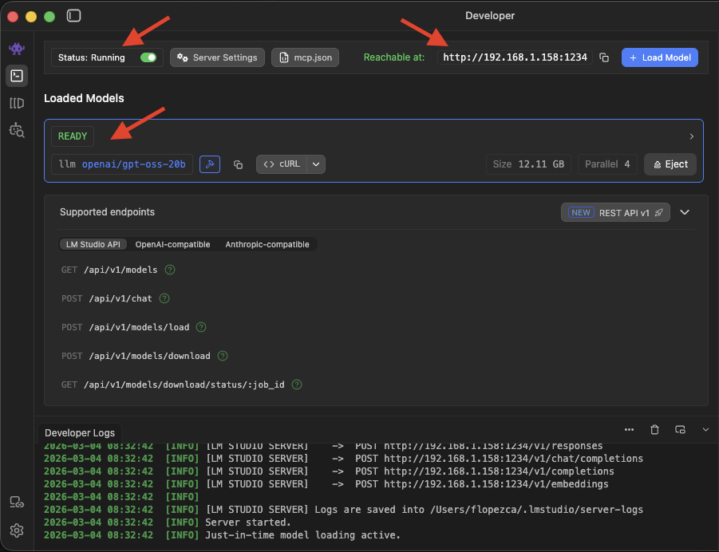
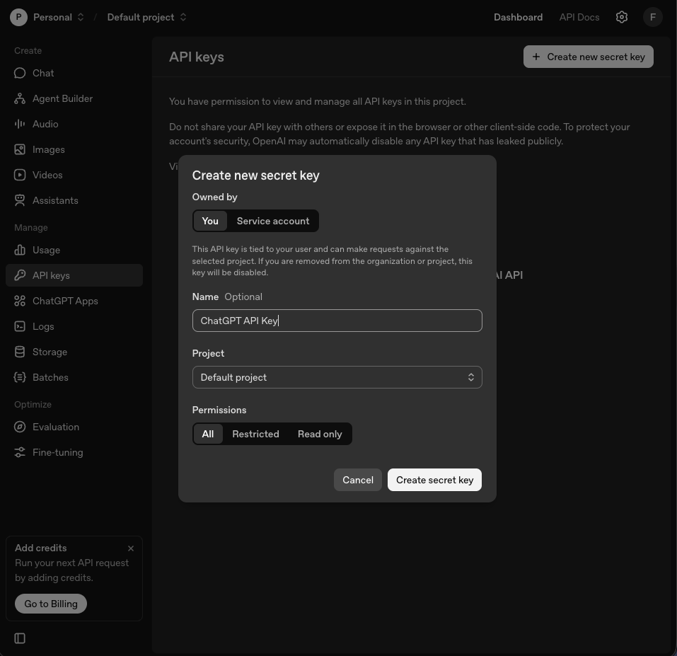
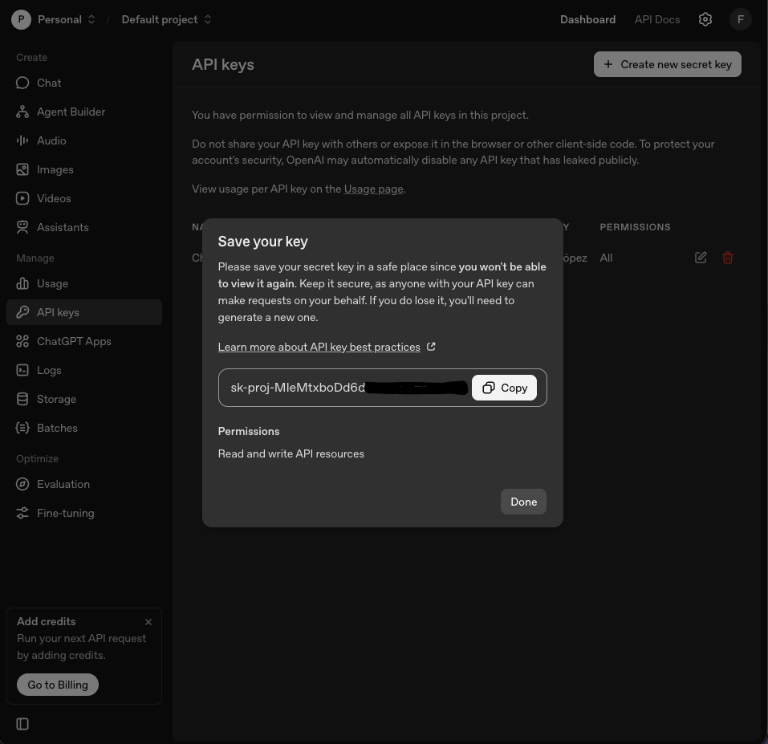

# AI Summary Comparator

Compare two LLM-generated summaries of a biomedical article and score them with ROUGE-L and BERTScore.

## Requirements

- Python 3.12+
- uv (python package manager)
- LM Studio or compatible LLM REST API endpoint.
- Downloaded models to be used with LM Studio (e.g., openai/gpt-oss-20b)

## Setup

### 1. Clone the repository

```bash
git clone https://github.com/ferlopezcarr/ai-summary-comparator.git
cd ai-summary-comparator
```

Run the following commands in your terminal to set up the virtual environment and install dependencies:

### 2. Create and activate a virtual environment

```bash
python -m venv .venv
source .venv/bin/activate  # On Windows: .venv\Scripts\Activate.ps1
```

### 3. Install dependencies

```bash
uv sync
```

or

```bash
pip install -e . # If pip is not in PATH: python -m pip install -e .
```

### 4. Configure LLM

It is up to the user to decide whether to choose a local LLM model via LM Studio or an online model (e.g., ChatGPT).

#### Option 1: LM Studio setup

- Install LM Studio from https://lmstudio.ai/ and follow the instructions to set it up locally.

- Download and load the desired model (e.g. openai/gpt-oss-20b) into LM Studio.

- Ensure LM Studio is running and copy the **local endpoint URL** (default is http://192.168.1.154:1234).

- Ensure that the model is in status "ready" in LM Studio before running the script.



- Create a `.env` file next to the `main.py` file (you can copy the .env.example) with your **local endpoint URL** or model details if they differ.

Example .env content:

```.env
LLM_BASE_URL = "http://192.168.1.154:1234/v1" # The default client points to LM Studio at this address, change if your setup differs
LLM_MODEL_NAME = "openai/gpt-oss-20b"  # Can be emtpy if there's only one model loaded
LLM_API_KEY = ""  # Can be any string, as the API key is not required for this local setup

RESOURCE_DIR = "resources"
INPUT_DIR = f"{RESOURCE_DIR}/input"
OUTPUT_DIR = f"{RESOURCE_DIR}/output"
```

> [!NOTE]  
> The **local endpoint URL** should be used in OpenAI API compatibility mode, so the URL should point to the **OpenAI-compatible endpoint** (ending in `/v1`) (e.g., [http://192.168.1.154:1234/**v1**](http://192.168.1.154:1234/v1)).

#### Option 2: Online LLM setup (e.g., ChatGPT)

- If you want to use an online LLM (e.g., ChatGPT), ensure you have access to the API and obtain your API key.

  For ChatGPT, you can sign up for API access at https://platform.openai.com/signup and create an API key in the dashboard.
  

  Then you need to copy the API key and add it to the `.env` file along with the appropriate base URL and model name for the online LLM.
  
  

- Update the `.env` file with the appropriate values for `LLM_BASE_URL`, `LLM_MODEL_NAME`, and `LLM_API_KEY` for your chosen online LLM.

  ```.env
  LLM_BASE_URL = "https://api.openai.com/v1" # For online LLMs, this should be the API base URL (e.g., https://api.openai.com/v1)
  LLM_MODEL_NAME = "gpt-4.1" # The model name to use for the online LLM (e.g., "gpt-4.1" for ChatGPT)
  LLM_API_KEY = "sdk-proj-XXXXXXXXXXXXXXXX" # Your actual API key for the online LLM

  RESOURCE_DIR = "resources"
  INPUT_DIR = f"{RESOURCE_DIR}/input"
  OUTPUT_DIR = f"{RESOURCE_DIR}/output"
  ```

### 5. Configure prompts

- The prompts that need to be filled for generating summaries are defined in [prompt_service.py](src/application/services/prompt_service.py).
- Adjust the prompts as needed for your specific use case or to adjust summary quality.

## Run

### 1. Activate the virtual environment if not already active

You can check if the virtual environment is active by looking at your terminal prompt (it should show `(.venv)` at the beginning).

If it's not active, run:

```bash
source .venv/bin/activate  # On Windows: .venv\Scripts\Activate.ps1
```

### 2. Run the main script

Use module mode so imports resolve correctly:

```bash
python -m src.main
```

After doing all configurations you should see the generated summaries and their ROUGE-L and BERTScore F1 scores printed in the console.

## Resources

The `resources` folder will contain the input files and output results. You can customize the input article and reference summary, and the generated summaries and evaluation results will be saved here as well.

### Inputs

The folder [resources/input](resources/input) contains the input files where you should place:

- The article text in [article.md](resources/input/article.md).
- The reference summary in [reference_summary.md](resources/input/reference_summary.md).

### Outputs

The folder [resources/output](resources/output) will contain the generated summaries and evaluation results:

- Prints the basic and advanced summaries.
- Prints ROUGE-L and BERTScore F1 for each summary.
